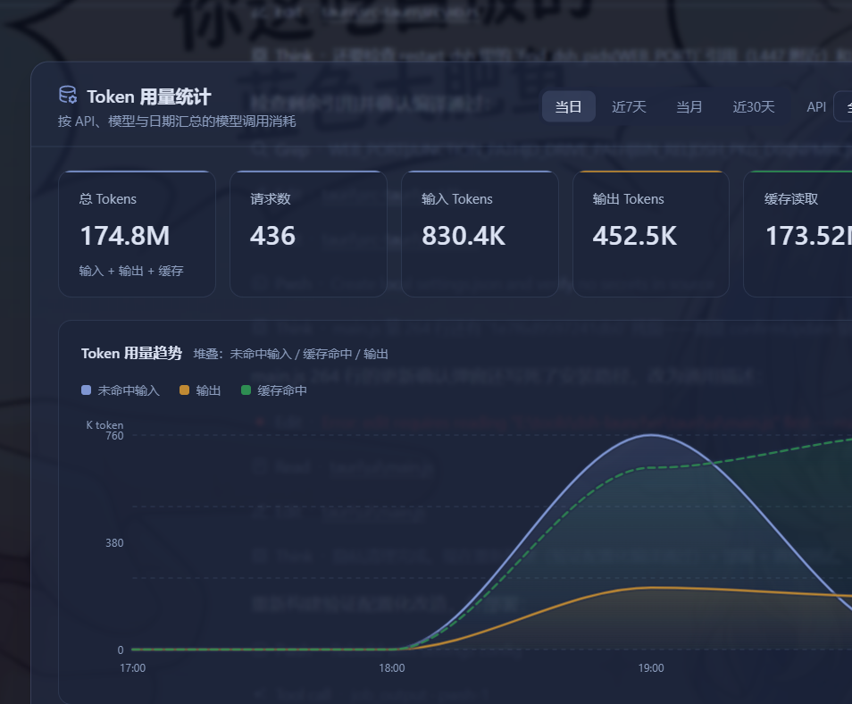

# DSH Whale Launcher 🐋

DeepSeek Harness 图形界面一键启动器 —— 基于 **Tauri 2**（Rust + WebView2）构建，
**单个原生 exe（约 7.6MB）**，GPU 合成渲染、CSS 动画、拖动丝滑。



## 功能

- **一键启动**：Web 界面 / TUI 终端 / Headless 无头问答（结果窗口保持打开）
- **重启 DSH**：停止 3080 端口进程后按当前配置重新启动
- **启动前自检**：Node.js / DSH 程序文件 / 目录联接 junction / npm 缓存 / 系统代理 / 运行状态
- **代理支持**：勾选后自动注入 `HTTP_PROXY` / `HTTPS_PROXY` 与 `NODE_USE_ENV_PROXY=1`
  （Node 的 fetch 默认忽略环境变量代理，此开关是代理生效的关键），
  开启时自动同步 Windows 系统代理地址
- **状态轮询**：每 2 秒检测 DSH 运行状态（状态胶囊）
- **更新检测与手动更新**：自动检查 `@deepseek-ai/dsh` 新版本（npm registry），
  发现后仅提示，由用户点击「立即更新」并二次确认后执行 `npm install`，绝不自动更新
- **深色 / 浅色主题**：CSS 变量一键切换，配置存 WebView2 localStorage
- **Headless 历史**：最近任务一键重跑
- **快捷工具**：打开安装目录 / 复制 Web 启动命令 / 复制修复命令

## 性能对比

| | 旧版 PySide6 | **Tauri 2（本仓库）** |
|---|---|---|
| 产物 | exe + `_internal\` 60MB | **单个 exe 7.6MB** |
| 运行内存 | ~113MB | **~28MB** |
| 动画 | Qt 属性动画 | CSS（GPU 合成） |
| 打包 | PyInstaller（DLL 依赖链复杂） | `cargo build --release` 一条命令 |

## 安装使用

1. 下载 `DSH启动器.exe`（本仓库的 Release 或自行构建），放在任意目录
2. 在同目录创建 `settings.json`（按你的环境填写，见下节）
3. 双击 exe 运行。需要 WebView2 运行时（Win10/11 系统自带）

### settings.json 配置

所有机器相关路径都从 `settings.json` 读取，**源码中不含任何个人路径**：

```json
{
  "junctionPath": "C:\\Users\\<你的用户名>\\AppData\\Local\\npm-cache\\_npx\\<hash>",
  "dDrivePath": "D:\\npm-cache\\_npx\\<hash>",
  "npmrcPath": "C:\\Users\\<你的用户名>\\.npmrc",
  "webPort": 3080
}
```

缺省值为空，未配置时自检项会显示 FAIL，配置后自动恢复。

## 构建

需要 Rust 工具链（MSVC target）与 [WebView2](https://developer.microsoft.com/microsoft-edge/webview2/)（构建机 Win10/11 自带）。

```bash
cd tauri/src-tauri
cargo build --release
# 产物：tauri/src-tauri/target/release/dsh-launcher.exe（前端资源已嵌入）
```

换图标：更新 `assets` 源图 → 生成 `assets/launcher.ico` → 复制为
`tauri/src-tauri/icons/icon.ico` → 重新 `cargo build --release`。

## 项目结构

```
├── tauri/
│   ├── ui/              前端（index.html / style.css / main.js，纯静态无构建链）
│   ├── src-tauri/       Rust 后端（src/lib.rs 全部命令逻辑）
│   └── docs/            文档图片
├── assets/              全部图像资源（原图 / 抠图 / 生成的图标）
├── tools/               图像处理脚本（make_icon.py / cutout_bg.py）
└── archive/             已归档的旧版本（PySide6 版源码，仅作参考）
```

## 技术栈

- [Tauri 2](https://tauri.app/) —— Rust + WebView2，单文件原生应用
- 前端：原生 HTML/CSS/JS（零 npm 依赖）
- 后端：Rust（所有阻塞操作在后台线程执行，UI 零阻塞）

## 说明

- 图标素材为个人使用图片，请勿用于商业用途。

## License

[MIT](LICENSE)
