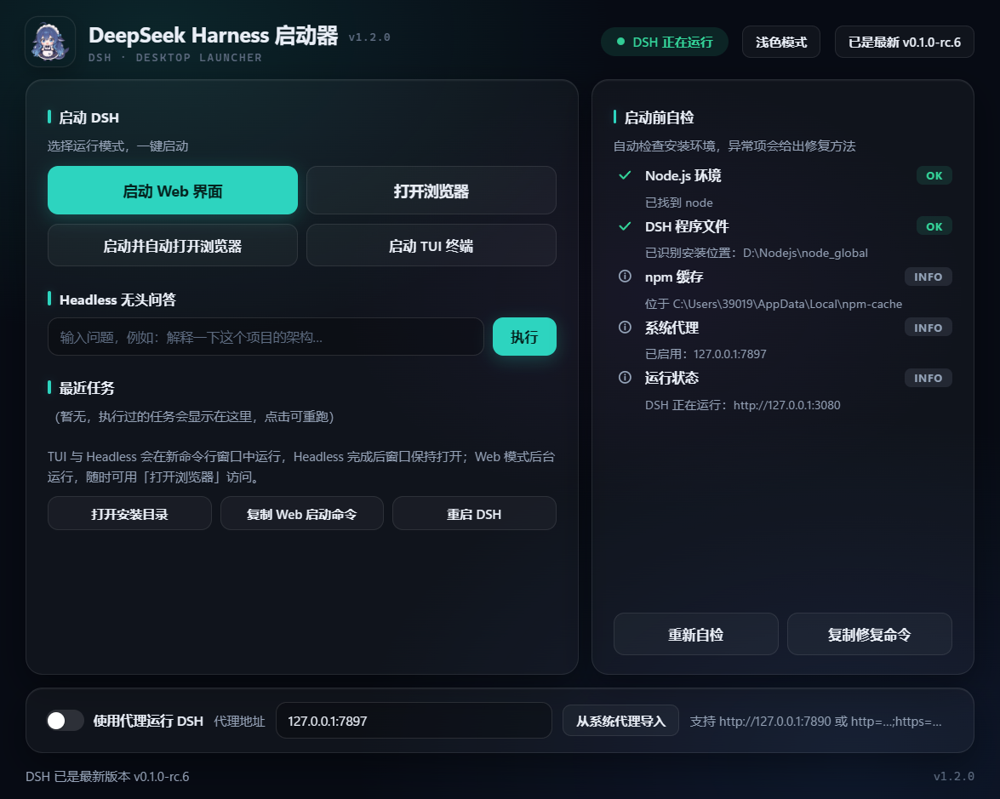
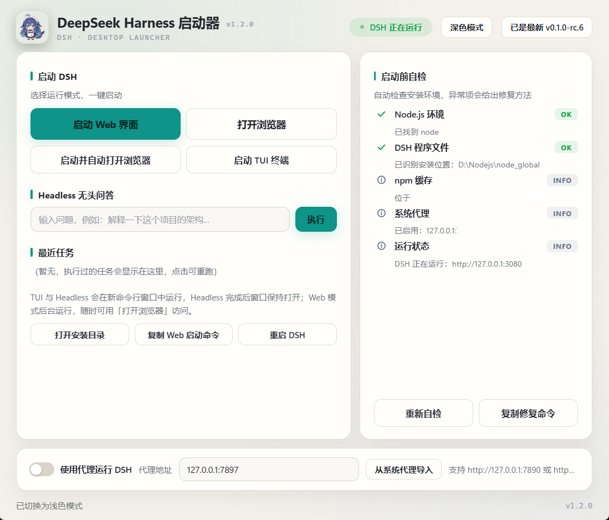

# DSH Whale Launcher 🐋

DeepSeek Harness 图形界面一键启动器 —— 基于 **Tauri 2**（Rust + WebView2）构建，
**单个原生 exe（约 7.6MB）**，GPU 合成渲染、CSS 动画、拖动丝滑。

| 深色模式 | 浅色模式 |
| :---: | :---: |
|  |  |

## 功能

- **一键启动**：Web 界面 / TUI 终端 / Headless 无头问答（结果窗口保持打开）
- **重启 DSH**：停止 3080 端口进程后按当前配置重新启动
- **启动前自检**：Node.js / DSH 程序文件（自动识别安装位置）/ npm 缓存 / 系统代理 / 运行状态
- **代理支持**：勾选后自动注入 `HTTP_PROXY` / `HTTPS_PROXY` 与 `NODE_USE_ENV_PROXY=1`
  （Node 的 fetch 默认忽略环境变量代理，此开关是代理生效的关键），
  开启时自动同步 Windows 系统代理地址
- **状态轮询**：每 2 秒检测 DSH 运行状态（状态胶囊）
- **更新检测与手动更新**：自动检查 `@deepseek-ai/dsh` 新版本（npm registry），
  发现后仅提示，由用户点击「立即更新」并二次确认后执行 `npm install`，绝不自动更新；
  未安装 DSH 时提示「未安装」，可一键执行 `npm install -g` 完成安装
- **深色 / 浅色 / 跟随系统主题**：CSS 变量一键切换（三态循环），默认跟随
  系统深浅色并即时响应系统切换，配置存 WebView2 localStorage
- **窗口状态记忆**：窗口位置与大小自动保存，重启后恢复（最大化时保护不覆盖）
- **Headless 历史**：最近任务一键重跑
- **插件管理**：窗口内独立视图（header「插件管理」进入，一键返回首页）——
  插件列表（仅展示用户插件，内置组件不显示），一键安装（输入 npm 包名）、
  卸载、**启用/禁用**（cordis.patch.yml disabled 条目，保留安装、暂时停用）；
  「检查更新」并行查询 registry 发现新版本后，对应插件行才会出现「更新」
  按钮（支持单个或全部更新）；点击插件行展开**详情**（版本/许可/主页/README）
  与操作——全部走官方 `dsh plugin --profile web <add|remove|update>` 通道
  （内部转发 pnpm 并自动对账 bundles），变更后重启 DSH 生效；自检新增 pnpm
  环境检查
- **系统托盘**：关闭窗口最小化到托盘（后台保持状态轮询），托盘左键单击
  恢复窗口、右键菜单「打开主窗口 / 退出」；重复启动 exe 只聚焦已有窗口
  （单实例）
- **运行日志面板**：安装/更新等 npm/pnpm 操作的完整输出实时显示在可收起的
  日志面板；页脚「web.log」链接可直接查看 DSH Web 模式日志尾部
- **快捷工具**：打开安装目录 / 复制 Web 启动命令 / 复制修复命令
- **设置页**（窗口内视图）：代理配置（原首页代理条迁入）、启动时自动检查更新、
  启动 Web 后自动打开浏览器、开机自启（注册表 Run 键）、关闭按钮行为
  （隐藏到托盘 / 直接退出）、插件管理 profile 选择、npm registry 镜像、
  清空 Headless 历史——settings.json 相关项即时保存并生效

## 性能对比

| | 旧版 PySide6 | **Tauri 2（本仓库）** |
|---|---|---|
| 产物 | exe + `_internal\` 60MB | **单个 exe 7.6MB** |
| 运行内存 | ~113MB | **~28MB** |
| 动画 | Qt 属性动画 | CSS（GPU 合成） |
| 打包 | PyInstaller（DLL 依赖链复杂） | `cargo build --release` 一条命令 |

## 安装使用

1. 下载 `DSH启动器.exe`（本仓库的 Release 或自行构建），放在任意目录
2. 在同目录创建 `settings.json`（按你的环境填写，见下节）
3. 双击 exe 运行。需要 WebView2 运行时（Win10/11 系统自带）

### settings.json 配置（全部可选）

DSH 安装位置**自动识别**，无需手动配置：依次检查 settings.json 中显式填写的路径
（如有）、npm 全局安装目录（`npm root -g`）、npx 缓存目录（npm cache /
`%LocalAppData%\npm-cache` 下的 `_npx\<hash>`）。任何安装布局（默认 C 盘、D 盘、
全局安装）都能直接使用，不再要求"挪到 D 盘 + junction"。

`settings.json` 只需放在 exe 同目录，按需填写：

```json
{
  "junctionPath": "C:\\Users\\<你的用户名>\\AppData\\Local\\npm-cache\\_npx\\<hash>",
  "dDrivePath": "D:\\npm-cache\\_npx\\<hash>",
  "webPort": 3080
}
```

- `junctionPath` / `dDrivePath`：可选。仅在显式填写时作为 DSH 安装位置的候选路径，
  不填则完全自动识别
- `webPort`：可选，DSH Web 服务端口，默认 3080
- 缺失或未配置时所有字段使用缺省值，不影响启动器正常工作

## 构建

需要 Rust 工具链（MSVC target）与 [WebView2](https://developer.microsoft.com/microsoft-edge/webview2/)（构建机 Win10/11 自带）。

```bash
cd tauri/src-tauri
cargo build --release
# 产物：tauri/src-tauri/target/release/dsh-launcher.exe（前端资源已嵌入）
```

换图标：更新 `assets` 源图 → 生成 `assets/launcher.ico` → 复制为
`tauri/src-tauri/icons/icon.ico` → 重新 `cargo build --release`。

## 项目结构

```
├── tauri/
│   ├── ui/              前端（index.html / style.css / main.js，纯静态无构建链）
│   ├── src-tauri/       Rust 后端（src/lib.rs 全部命令逻辑）
│   └── docs/            文档图片
├── assets/              全部图像资源（原图 / 抠图 / 生成的图标）
├── tools/               图像处理脚本（make_icon.py / cutout_bg.py）
└── archive/             已归档的旧版本（PySide6 版源码，仅作参考）
```

## 技术栈

- [Tauri 2](https://tauri.app/) —— Rust + WebView2，单文件原生应用
- 前端：原生 HTML/CSS/JS（零 npm 依赖）
- 后端：Rust（所有阻塞操作在后台线程执行，UI 零阻塞）

## 图标署名与授权

鲸鱼娘图标素材的署名与授权如下（来源仓库：
[fornarwhal/deepseek-whale-girl-icon](https://github.com/fornarwhal/deepseek-whale-girl-icon)）：

- **角色形象来源**：上善无形（原创 OC「溟月」）
- **DeepSeek 元素二创**：ZipZipPipe（GPT Image 2）
- **改进版修复**：QYQCAMIAO
- **授权协议**：**CC BY-NC-SA 4.0**（须署名、非商用、相同方式共享）

许可说明：

- 本仓库**代码**（tauri/ 等）遵循 [MIT](LICENSE) 许可
- 本仓库**图标素材**（assets/、tauri/src-tauri/icons/、tauri/ui/logo.png）遵循
  **CC BY-NC-SA 4.0**，仅限署名、非商业用途，衍生作品须以相同方式共享
- 素材来自网络流传，具体作者未完全确认；如原作者认为不妥，请联系删除

## License

[MIT](LICENSE)
